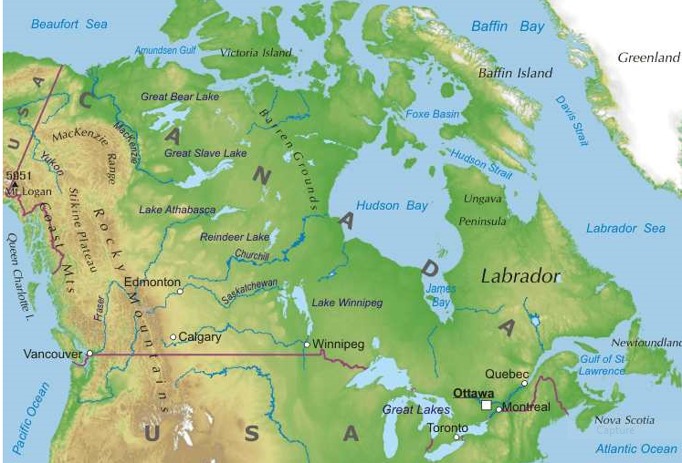

# Raumanalyse Kanada - Pascal Riesinger
## Inhaltsverzeichnis
1. [Naturräumliche Ausstatung](#naturräumliche-ausstattung)
    - [Lage](#lage)
    - [Relief](#relief)
    - [Klima](#klima)
    - [Böden](#böden)
    - [Gewässer](#gewässer)
    - [Rohstoffe](#rohstoffe)
    - [Vegetation](#vegetation)
    - [Naturgefahren](#naturgefahren)
2. [Quellen](#quellen)
    - [Bilder](#bilder)
    - [Textquellen](#textquellen)
    - [Sonstige Quellen](#sonstige-quellen)

## Naturräumliche Ausstattung
### Lage
Kanada liegt zwischen dem Atlantik im Osten und dem Pazifik im Westen. Die einzige direkte Landesgrenze
befindet sich im Süden zu den Vereinigten Staaten von Amerika. Außerdem nimmt das Land mit einer Größe von
etwa 9.990.000 Quadratkilometern ca. 41% der Landmasse Nordamerikas ein und ist daher das flächenmäßig 
zweitgrößte Land nach Russland. Zudem besitzt Kanada mit einer Länge von ca. 243.800 Kilometern die längste
Küste weltweit. Nördlich grenzt Kanada an den Arktischen Ozean.

### Relief
Kanadas Relief ist überaus vielseitig, was nicht zuletzt von seiner Größer herrührt. Rund um die Hudson Bay
gelegen befindet sich der sogenannte Kanadische Schild, einem präkambischen Gebiet aus extrem altem Gestein.
Hier liegt die durchschnittliche Höhe zwischen 400 und 600 Metern. Der Westrand dieses Gebietes wir duch große
inländische Seen wie zum Beispiel dem Great Bear Lake gebildet.
Im Westen Kanadas liegt die Fortsetzung der Rocky Mountains, in welchen sich auch die höchste Erhebung des
Landes findet. Der Hauptgipfel des Mount Logan erreicht eine Höhe von 5959 Metern, drei weitere Gipfel kommen
auf höhen von über 5890 Metern. In Ostrichtung, also zur Halbinsel Labrador hin, ist das Relief eher flach bis
bis leicht hügelig.

### Klima

### Böden
* Relativ wenig Wiesen- / Weidefläche
* Nur wenig Bodennutzung zu Agrarzwecken
    - V.a. in Süd-Alberta und Saskatchew 
    - Dennoch relaltiv gute Böden 

### Gewässer

### Rohstoffe 

### Vegetation 
* Größtenteils Tundra
* Bedeckt von Nadelwäldern, fast gar kein Laubwald
* Vor allem im Süden stark bewaldet, mit Ausnahme von Süd-Alberta & Saskatchew (s. Böden)

### Naturgefahren

## Quellen
### Bilder
- Übersichtskarte Kanada: https://www.weltkarte.com/typo3temp/images/uebersichtskarte-kanada.png (Stand: 06.06.16)

### Textquellen
- Emanuel Buchot: http://www.voyagesphotosmanu.com/geographie_kanadas.html (Stand: 10.06.16)
- Mount Logan: https://de.wikipedia.org/wiki/Mount_Logan (Stand: 12.06.16)
- Kanadisches Schild: http://www.indianerwww.de/indian/kanadisches_schild.htm (Stand: 12.06.16)
- http://www.geographixx.de/mdb/laenderinfos.asp?land=Kanada (Stand: 13.06.16)
- https://de.wikipedia.org/wiki/Kanada#Geologie_und_Landschaftsgliederung (Stand: 14.06.16)

### Sonstige Quellen 
- Dircke Weltatlas (Ausgabe 2015)
