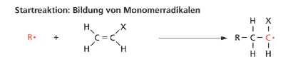
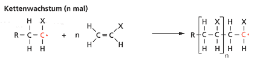
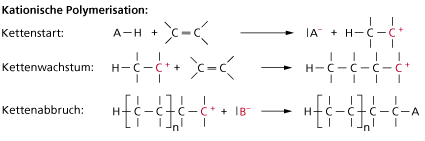
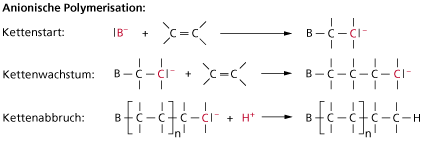
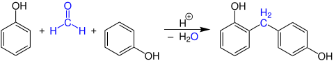
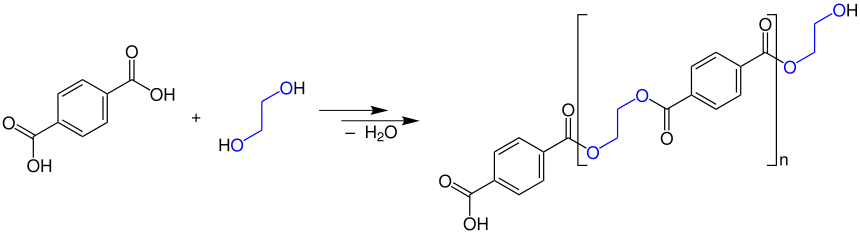
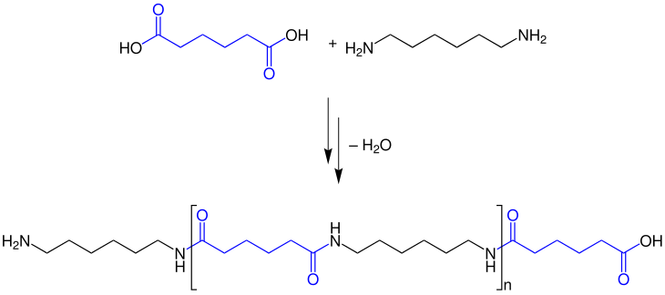

## Aminosäuren & Proteine
Aminosäuren sind die Bestandteile der Proteine. Sie sind für den menschlichen Körper extrem wichtig.
Dabei gibt es 8 essentielle, d.h. vom Körper nicht produzierbare Aminosäuren.

### Struktur

Alle Aminosäuren habe eine Carboxylgruppe (COOH) und eine Aminogruppe (NH~2~), dabei ist die Aminogruppe
immer an einem Kohlenstoffatom direkt am Kohlenstoffatom der Carboxylgruppe zu finden.

Das C-Atom, an welchem die Aminogruppe hängt, wird auch als ɑ-Kohlenstoffatom bezeichnet.
In der Natur treten in größten Teilen L-ɑ-Aminosäuren auf, d.h. die Aminogruppe ist wie im Beispiel von 
Glycin (in der Fischer-Projektionsformel) nach links gedreht.

### Zwitterionische Struktur

Aminosäuren bilden ein Gitter ähnlich dem des Kochsalzes. 

Da sie jedoch nicht als Ionen vorliegen, müssen sich die Ladungen im Molekül verschieben und es 
entsteht ein **Zwitterion**. Die Carboxylgruppe dient innerhalb des Moleküls als Protonendonator, 
die Aminogruppe als Protonenakzeptor. Durch die zwitterionische Struktur reagieren Aminosäuren als 
**Ampholyte**.

### Der Isoelektrische Punkt
Der Isoelektrische Punkt ist der Punkt, an welchem die Aminosäuren (maximal) als Zwitterion vorliegen.
Er ist daher charakteristisch für jedes zwitterionische Molekül. Er lässt sich durch die folgende Formel
berechnen:
$$ pH = (pK_{s1} + pK_{s2}) \div 2 $$
Die beiden $ pK_s $ Werte lassen sich durch ablesen einer Titrationskurve bestimmen. Der erste Punkt
liegt dabei bei der Hälfte zum ersten Äquivalenzpunkt, der zweite auf der Mitte zwischen den
Äquivalenzpunkten. Daher ist der isoelektrische Punkt **gleich dem ersten Äquivalenzpunkt**.

### Peptidbindungen
Als **Peptidbindung** bezeichnet man die Bindung zwischen der Carboxylgruppe einer Aminosäuren und der
Aminogruppe einer anderen Aminosäuren.

Alle an einer Peptidbindung beteiligten Atome liegen in einer Ebene, was sich durch Mesomerie erklären
lässt. Zudem ist die $C-N$-Bindung verkürzt, daher könnte man meinen, dass die Bindungselektronen
zwischen ihnen delokalisiert sind und es sich um eine Hybridform einer Einfach- und Zweifachbindung
handelt. Außerdem sind die bindenden Atome $sp^2$ hybridisiert, was die Bindung stark und nicht drehbar
macht.

### Nachweise von Aminosäuren und Proteinen
Es gibt mehrere Nachweisreaktionen um das Vorhandensein von Aminosäuren fest zu stellen.

#### Biuret-Reaktion
Diese Reaktion beruht darauf, dass die Proteine an ihren Stickstoff-Atomen mit Kupfer(II)-Ionen farbige
Komplexverbindungen bilden

#### Xanthoprotein-Reaktion
Diese Nachweisreaktion dient nur zum Nachweis von aromatischen Aminosäuren (also welchen mit Benzolring).
Bei der Zugabe von Salpetersäure (HNO~3~) findet eine Nitrierung des Benzolrings statt. 

### Struktur von Proteinen
Man unterscheidet bei den Proteinen zwischen der Primär-, Sekundär-, Tertiär-, und Quartiärstruktur:

#### Primärstruktur
Die Primärstruktur beschreibt die Abfolge der Aminosäuren innerhalb eines Proteins. Man notiert diese so,
dass die letzte Aminogruppe (N-terminales Ende) ganz links, sowie die letzte freie Carboxylgruppe 
(C-terminales Ende) ganz rechts stehen.

#### Sekundärstruktur
Die Sekundärstruktur beschreibt die räumliche Struktur eines Proteins. Dabei gibt es zwei Möglichkeiten:
**α-Helix** oder **β-Faltblatt**.

Die α-Helix entsteht dabei durch *intra*molekulare Kräfte, genauer den Wasserstoffbrücken zwischen den
Peptidbindungen. Die Aminosäurereste zeigen bei der immer **rechtsgängigen** Helix nach außen.

Die β-Faltblatt-Struktur entsteht durch *inter*molekulare Kräfte, nämlich Wasserstoffbrücken zwischen 
nebeneinanderliegenden Peptidketten. Dabei stehen die Aminosäurereste abwechselnd nach oben und unten.

#### Tertiärstruktur
Die Tertiärstruktur beschreibt die räumliche Anordnung aller Atome innerhalbe eines Proteins. Es gibt
einige für die Ausbildung der Tertiärstruktur bedeutsame Bindungen:

**Echte Bindungen**

- Disulfidbrücken: Entstehen, wenn zwei Cysteinreste miteinander reagieren
- Ionenbindung zwischen funktionellen Gruppen

**Zwischenmolekulare Kräfte**

- Wasserstoffbrücken
- Van-der-Waals-Kräfte

#### Quartiärstruktur
Die Quartiärstruktur beschreibt das Zusammenwirken und die Verbindung mehrerer Proteinketten durch die
bei der Tertiärstruktur genannten Kräfte. Ein Beispiel für ein Molekül mit Quartiärstruktur ist
**Hämoglobin**.

### Denaturierung
Als Denaturierung bezeichnet man die Veränderung der räumlichen Struktur eines Proteins. Dabei geht evtl.
auch die biologische Funktion des Proteins verloren. Normalerweise wird jedoch die Primärstruktur nicht
verändert. Die Denaturierung ist oftmals nicht (oder nur sehr schlecht) umkehrbar.

#### Durch Hitze
Durch Wärmeeinwirkung brechen Bindungen und es entstehen neue. Dadurch ändern sich nicht nur die 
Verhältnisse innerhalb eines Moleküls, sondern auch die Verhältnisse zwischen Molekülen.

#### Durch eine Änderung des pH-Wertes
Durch die protonierung der Seitenketten ändern sich die elektrischen Ladungsverhältnisse, sodass 
viele Bindungen auseinanderbrechen. Ein Beispiel dafür ist saure Milch, die ausflockt.

#### Durch Saltze und Ethanol
Bei einer hohen Salzkonzentration stehen nicht mehr genügend H~2~O-Moleküle für die Hydratisierung der
Proteine zur verfügung, weswegen sie nicht mehr gelöst sind und **Aussalzen**. Aufgrund der Konkurrenz
um Wasserstoffbrücken kommt es dabei auch zur Denaturierung. Die Hydroxylgruppen der Ethanolmoleküle
bewirken eine Störung der Wasserstoffbrücken, sodass auch hier das Protein denaturiert ➔ Desinfektion.

#### Durch Reduktionsmittel
Die Denaturierung durch Reduktionsmittel, bei welcher die Disulfidbrücken reduktiv gespalten werden,
sind durch Oxidation reversibel (bspw. Dauerwelle).

#### Durch Schwermetalle
Schwermetallionen binden sich an Aminosäurereste und stören so die elektrostatischen Wechselwirkungen ➔
veränderung der Tertiärstruktur.

## Kohlenhydrate

## Kunststoffe

Als Kuststoffe werden künstlich synthtetisierte Stoffe bezeichnet, welche so nicht in der Natur vorkommen.
Häfig sind die **Polymere** gemeint, welche Makromoleküle aus vielen **Monomeren** sind. Der 
**Polymerisationsgrad** beschreibt, wie viele Monomere in einem Polymer enthalten sind, also wie lang
die einzelnen Polymerketten sind. Neben Polymeren, die nur aus demselben Monomer bestehen, gibt es auch
die sog. **Copolymere**, welche aus zwei oder mehr verschiedenen Monomeren bestehen.

Bei den Polymeren unterscheidet man drei verschiedene Gruppen, nämlich:

- Thermoplaste
- Duroplaste
- Elastomere

Diese drei Gruppen haben alle unterschiedliche Verwendungszwecke und Eigenschaften:

Polymer      | Struktur                                                | Härte & Elastizität
---          | ---                                                     | ---
Thermoplaste | Lange, nicht vernetzte Ketten                           | Beim Erwärmen weich & formbar
Duroplaste   | Kurze, sehr stark vernetzte, 3-Dimensionale Ketten      | Sehr hart, spröde, brüchig
Elastomere   | Relativ kurze, leicht verzweigte, 2-Dimensionale Ketten | Weich, gummielastisch

Grundsätzlich sind Thermoplaste die (chemisch gesehen) beständigsten Kunststoffe. Während Elastomere
weder Lösungsmitteln, Säuren noch Basen bestehen, können dies einige Duroplasten und viele Thermoplaste.

### Taktizität
Die Taktizität beschreibt die Anordnung der Seitengruppen. Dabei gibt es drei mögliche Varianten:

- Isotaktisch: Alle Reste zeigen in eine Richtung
- Syndiotaktisch: Die Reste zeigen abwechselnd nach vorne und hinten
- Ataktisch: Die Reste sind zufällig angeordnet

Je regelmäßiger der Aufbau eines Polymers ist (also je Höher seine Taktizität), desto leichter kann
eine Kristallstruktur hergestellt werden. Dies beeinflusst dann die Härte, Sprödigkeit und 
Formbeständigkeit. Die Taktizität lässt sich durch die Auswahl des zur Herstellung verwendeten 
Katalysators  beeinflussen. Durch die Wahl von **Ziegler-Natta-Katalysatoren**, welche metallorganischen
Ursprungs sind, entstehen *größtenteils* isotaktische Polymere. Durch die katalytische Polymerisation
konnte das alte Verfahren Polyethylen herzustellen, welches sehr hohen Druck und hohe Temperaturen
erforderte, durch ein neues System, bei welchem nur Normaldruck und Raumtemperatur benötigt werden,
abgelöst werden. Außerdem entseht hierbei ein Polyethylen mit **höherer Kristallinität** und
somit auch mit höheren Härte und Steifigkeit. Das Verfahren, welches durch Karl Ziegler entdeckt wurde,
wurde später von Giulio Natta verbessert.

### Herstellungsverfahren
Man unterscheidet zwischen drei Reaktionsmechanismen, um Polymere herzustellen.

#### Polymerisation
Um die Polymerisation durchzuführen wird ein Monomer mit mindestens einer **C=C-Doppelbindung**.
benötigt.
Es gibt eine Radikalische, Anionische und Kationische Polymerisation, bei welchen sich nur die
Edukte unterscheiden.

##### Radikalische Poylmerisation
Ein Monomer-Radikal wird gebildet, welches dann ein anderes Monomer angreift und dessen Doppelbindung
spaltet:

In diesem zweiten Schritt entsteht wieder ein Radikal, daher kann dieser unendlich lang wiederholt werden.
Die Kette Bricht ab, wenn sich zwei Radikale verbinden.

#### Kationische Polymerisation
Die Kationsche Polymerisation läuft ähnlich ab, wird jedoch durch eine starke Säure initiiert:

#### Anionische Polymerisation
Diese ist der kationischen Polymerisation gleich zu setzen, jedoch wird hier eine starke Base als
Initiator verwendet:

### Polykondensation
Durch die Polykondensation werden verschiedene Kunststoffe, wie z.B. Phenoplast, Polyester und Polyamide
hergestellt.

#### Phenoplast
Reaktion von Phenol mit einem Aldehyd. Dieser Schritt ist beliebig wiederholbar.

#### Polyester
Reaktion von Carbonsäuren mit Diolen. Wenn man statt eines Diols z.B. Glycerin als Ausgangsstoff
benutzt, entsteht ein Duroplast.

#### Polyamide
Damide reagieren mit Dicarbonsäuren durch Polykondensation zu Polyamiden (z.B. Nylon).

### Kuststoffe im Alltag
Im Alltag begegnen uns überall Kunststoffe, von Autoteilen, über Verpackungen, Flaschen, Werkzeuge bis
hin zu elektronischen Geräten. Einige Beispiele für die Nutzung von Kunststoffen:

- CD's & BluRays
- Fahrzeugsitze
- Flaschen
- Getränkekartons

### Recycling von Kunststoffen
Kunstoffabfälle werden heute immernoch zu großen Teilen verbrannt, was einer energetischen Verwertung
gleichkommt. Nur knapp über 40% werden wekstofflich verwertet, d.h. weiter verarbeitet. Dafür sind
allerdings nur reine, nicht verschmutzte Kunststoffe geeignet. Man zerkleinert diese oder schmilzt sie
ein, sodass neue Produkte aus ihnen hergestellt werden können. Ein kleiner Teil der Kunststoffe wird 
auch chemisch verarbeitet, d.h. man löst diese. Dabei entstehen die Monomere, Gase und Kohlenwasserstoffe.
Vorteil hier ist, dass auch stark verschmutzte Kunststoffe verwertet werden können.

### Biologisch abbaubare Kunststoffe
Nur ein geringer Anteil der heute verwendeten Kunststoffe ist biologisch abbaubar. Diese werden jedoch
immer wichtiger, z.B. in der Langwirtschaft und in der Medizin. Es gibt zwei mögliche 
Herstellungsverfahren, namentlich die Polymekondensation und die Polymerisation. Alle abbaubaren
Kunststoffe haben Ester oder Amidbindungen, welche dann von Mikroorganismen gespalten werden können.

## Farbstoffe
