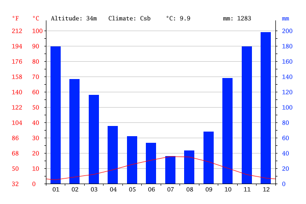

# Raumanalyse Kanada - Pascal Riesinger
## Inhaltsverzeichnis
1. [Naturräumliche Ausstattung](#naturräumliche-ausstattung)
    - [Lage](#lage)
    - [Relief](#relief)
    - [Klima](#klima)
    - [Böden](#böden)
    - [Gewässer](#gewässer)
    - [Rohstoffe](#rohstoffe)
    - [Vegetation](#vegetation)
    - [Naturgefahren](#naturgefahren)
2. [Wirtschaft](#wirtschaft)
3. [Politik](#politik)
4. [Quellen](#quellen)
    - [Bilder](#bilder)
    - [Textquellen](#textquellen)
    - [Sonstige Quellen](#sonstige-quellen)

## Naturräumliche Ausstattung
### Lage
Kanada liegt zwischen dem Atlantik im
Osten und dem Pazifik im Westen. Die einzige direkte Landesgrenze befindet sich
im Süden zu den Vereinigten Staaten von Amerika. Außerdem nimmt das Land mit
einer Größe von etwa 9.990.000 Quadratkilometern ca. 41% der Landmasse
Nordamerikas ein und ist daher das flächenmäßig zweitgrößte Land nach Russland.
Zudem besitzt Kanada mit einer Länge von ca. 243.800 Kilometern die längste
Küste weltweit. Nördlich grenzt Kanada an den Arktischen Ozean. Die Westküste
befindet sich noch im sogenannten *Ring of Fire*, wodurch es zu Erdbeben kommen
kann, dazu mehr unter [Naturgefahren](#naturgefahren). Die Hauptstadt Ottawa
liegt weit im Südosten des Landes.

### Relief
Kanadas Relief ist überaus vielseitig, was nicht zuletzt von seiner
Größer herrührt. Rund um die Hudson Bay gelegen befindet sich der sogenannte
Kanadische Schild, einem präkambischen Gebiet aus extrem altem Gestein. Hier
liegt die durchschnittliche Höhe zwischen 400 und 600 Metern. Der Westrand
dieses Gebietes wird durch große inländische Seen wie zum Beispiel dem Great
Bear
Lake gebildet. Im Westen Kanadas liegt die Fortsetzung der Rocky Mountains, in
welchen sich auch die höchste Erhebung des Landes findet. Der Hauptgipfel des
Mount Logan erreicht eine Höhe von 5959 Metern, drei weitere Gipfel kommen auf
höhen von über 5890 Metern. In Ostrichtung, also zur Halbinsel Labrador hin, ist
das Relief eher flach bis bis leicht hügelig.

### Klima
Kanada vereint auf seiner enorm großen Fläche unterschiedliche Klimazonen. Dabei
sind sowohl polare, als auch gemäßigte Klimazonen vorhanden. Am weitesten ist
jedoch das boreale Klima verbreitet. In größten Teilen Kanadas gibt es lange,
kalte Winter und relativ kurze, aber dennoch heiße Sommer. Die kälteste je in
Kanada gemessene Temperatur wurde mit -63°C in Snag in Yukon gemessen. 

Auf dem Klimadiagramm der Hauptstadt Ottawa sieht man, dass es sich um einen
eher kalten, feuchten Raum handelt. Die durchschnittliche Temperatur beträgt
6°C, während es im Schnitt 868mm Niederschlag gibt. Der kälteste Monat ist
Januar, hier liegt die Durchschnittstemperatur bei ca. -10°C. Der wärmste Monat
hingegen ist mit ca. 20°C der Juli. Während also die Temperaturen im
Jahresverlauf um 30°C schwanken, beläuft sich die Schwankung des Niederschlages
auf nur 30mm.

Das Klimadiagramm Vancouvers spiegelt jedoch ein gänzlich anderes Klima wieder.
Obwohl der wärmste und der kälteste Monat die gleichen wie in Ottawa sind, ist
die Temperaturschwankung zwischen 2°C im Januar und 18° im Juli mit nur 16°C
deutlich geringer. Auch gibt es in Vancouver wesentlich weniger Niederschlag
(maximal 198mm im Dezember).

### Böden
Es gibt in Kanada relativ wenig Wiesen- und Weidefläche, was die Agrarnutzung
als schwierig gestaltet. Im Süden des Kanadischen Schildes gibt es jedoch
äußerst fruchtbare Böden, diese sind vor allem im Süden Albertas und
Saskatchewans
gelegen. Hier wird auch ausgeprägte Landwirtschaft betrieben, so dass hier ein
Großteil der Kanadischen Agrarindustrie angesiedelt ist.

### Gewässer
Kanadas Inland ist gesäumt von einer Reihe großer Seen, welche im Norden durch
den *Great Bear Lake* und im Süden durch die *Great Lakes* genannte Ansammlung
von Seen. Allein die Binnengewässer umfassen mehr als das Doppelte der Fläche
Deutschlands.
Die Schifffahrt, vor allem in früheren Zeiten durch das Kanu, war schon immer
sehr wichtig für Kanada. Bis heute sind viele der großen Seen mit Fähren
ausgestattet, da einige Orte auch nur per See zu erreichen sind.
Auch die Wirtschaft Kanadas hat schon früh von der Schiffahrt profitiert.
Wichtige Seehäfen binden sich entlang des Sankt-Lorenz-Stromes und in Vancouver.

### Rohstoffe 
Kanada ist ein relativ Rohstoffreiches Land. Vor allem sind die Forstwirtschaft
und der Bergbau ausgeprägt. Somit ist das Land der größte Produzent von Zink,
Uran, Schwefel und anderen Bodenschätzen. Durch die scheinbar unendliche
Bewaldung spielt der Export von Holz, Papier und Zellstoff eine große Rolle für
das Land.
Kanada besitzt große Mengen von Erdöl und Erdgas, dabei ist ersteres vor allem
in Ölsand eingelagert. Die Vorkommen befinden sich überwiegend in Alberta und
sind so groß, dass Kanada Platz zwei nach Saudi-Arabien der weltweiten
Ölvorkommen belegt.

### Vegetation 
Kanada besteht zu großen Teilen aus von borealen Nadelwäldern bedeckter Tundra,
Laubwälder trifft man nur höchst selten an. Vor allem im Süden ist das Land
stark bewaldet, mit Ausnahme des Südens Albertas und Saskatchewans. Hier gibt es
große, von Bäumen befreite Ebenen (aufgrund der Landwirtschaft).
Durch die starke Bewaldung gibt es in Kanada eine sehr ausgeprägte
Forstwirtschaft.

### Naturgefahren
Kanada gilt im Gegensatz zum einzigen Nachbarland (den USA) als sicheres Land,
wenn es um Naturgefahren geht. Hier treten nur vereinzelt extreme Katastrophen
auf, auch wenn durchaus Potenzial besteht. Beispielsweise kann es, vor allem an
der Westküste auch zu Erdbeben kommen, da diese noch zum *Ring of Fire* zu
zählen ist. Durch Seebeben kann es auch zu Tsunamis kommen.
Das letzte starke Erdbeben (Richterskala 6,4) gab es am 09.09.2011 in British
Columbia. Dennoch wurden in den letzten Jahrzehnten kaum Menschen bei Erdbeben
in Kanada verletzt oder gar getötet.

Die am Atlantik liegenden Regionen Kanadas werden häufiger von Hurricanes
erreicht. Hier treten deutlich stärkere Zerstörungen als bei Erdbeben auf.
Besonders gefährdet ist hierbei die Provinz Nova Scotia, da sie geographisch
ungünstig als Halbinsel weit in den Atlantik hineinragt. Dennoch sind die
Hurricanes in Kanada bei weitem nicht so stark wie in den USA, da diese meistens
schon auf dem Land der USA abgebremst werden.

Auch Blizzards sind ein nicht seltenes Phänomen in Kanada, da es in Nordamerika
keine Gebirgszüge gibt, welche in Ost-West-Richtung verlaufen und somit vor den
Schneestürmen schützen würden. 

Tornados sind besonders unberechenbar und treten am häufigsten bei Gewittern
auf. In Kanada treten sie vorwiegend in südlichen Regionen auf, vor allem in
Ontario und Saskatchewan. In diesen beiden Provinzen gibt es auch gehäuft
Blitzeinschläge, weshalb sie auch die *Lightning Hot Spots* genannt werden.

# Wirtschaft
Mit einem Bruttoinlandsprodukt von 1,266 Billionen US-Dollar (Stand 2007) zählt
Kanada zu den wohlhabendsten Ländern der Welt. Dabei bilden Dienstleistungen
71,3% des BIP (Stand 2004), was zeigt, dass die Tertiärisierung in Kanada sehr
weit voran
geschritten ist. Mit einer Exportleistung von 456 Milliarden Kanadischer Dollar
(2005) ist das Land eine knappe Exportnation (vgl. Importe: 404 Milliarden
Kanadische Dollar). Dabei sind die Hauptabnehmer der kanadischen Exporte mit 70%
die USA, gefolgt von Großbritannien mit 2,5% und Japan mit 2,3%. Bei den
Importen tauschen Japan und Großbritannien den Platz, ansonsten bleiben diese
drei Nationen die größten Handelspartner. 

# Politik
Kanada ist ein Land mit einer konstitutionellen Monarchie und einer
parlamentarischen Demokratie. Der britische Monarch gilt als 
Staatsoberhaupt. Er wird durch einen General-Gouverneur vertreten, welcher nach
dem Vorschlag des kanadischen Premiers ernannt wird.
Dennoch wirkt der Monarch nur räpresentativ, der eigentliche Gesetzgeber, das
kanadische Parlament besteht aus dem General-Gouverneur, dem Oberhaus und dem
Unterhaus. Es hat seinen Sitz in der Hauptstadt Ottawa. Die Parteilandschaft
Kanadas ist ähnlich wie in den USA von zwei großen Parteien, der *Conservative
Party of Canada* und der *Liberal Party of Canada*, bestimmt. Dennoch gibt
es hier
deutlich bessere Chancen, auch für kleinere Parteien, was die Vielfalt im
Gegensatz zu den USA deutlich erhöht.

## Quellen 
### Bilder
- Übersichtskarte Kanada:
  https://www.weltkarte.com/typo3temp/images/uebersichtskarte-kanada.png (Stand:
  06.06.16)
- Klimadiagramm Ottawa: 
  http://images.climate-data.org/location/56/climate-graph.png (Stand: 22.06.16)
- Klimadiagramm Vancouver:
  http://images.climate-data.org/location/963/climate-graph.png (Stand: 22.06.16)

### Textquellen
- Allgemein:
    - https://de.wikipedia.org/wiki/Kanada (Stand: 14.06.16)
    - http://www.gokanada.com/de/kanada/ (Stand: 22.06.16)
- Geographie:
    - http://www.voyagesphotosmanu.com/geographie_kanadas.html (Stand: 10.06.16)
    - https://de.wikipedia.org/wiki/Mount_Logan (Stand: 12.06.16)
    - http://www.indianerwww.de/indian/kanadisches_schild.htm (Stand: 12.06.16)
    - http://www.geographixx.de/mdb/laenderinfos.asp?land=Kanada (Stand: 13.06.16)
- Klima:
    - http://www.beste-reisezeit.org/pages/amerika/kanada.php (Stand: 21.06.16)
    - http://de.climate-data.org/location/56/
    - http://de.climate-data.org/location/963/
- Naturgefahren:
    - https://de.wikipedia.org/wiki/Klimaextreme_in_Nordamerika (Stand: 21.06.16)
    - http://www.kanada-canada.de/naturkatastrophen/ (Stand: 21.06.16)
- Rohstoffe und Wirtschaft
    - http://www.diercke.de/content/nord-und-mittelamerika-landwirtschaft-978-3-14-100800-5-209-5-1?&stichwort=kanada (Stand: 21.06.16)
    - https://de.wikipedia.org/wiki/Wirtschaft_Kanadas#Rohstoffe (Stand 23.06.16)
- Politik
    - http://www.faszination-kanada.com/kanada-entdecken/kultur-geschichte/politik-in-kanada/
      (Stand 23.06.16)

### Sonstige Quellen 
- Diercke Weltatlas (Ausgabe 2015)

